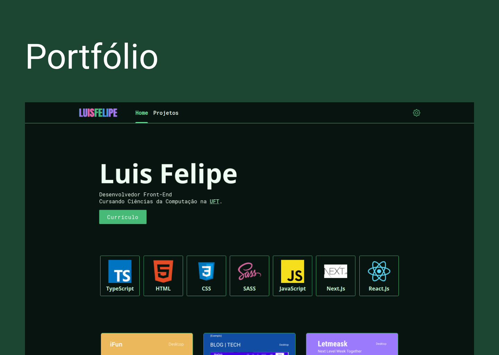

<h1  align="center">
    
</h1>

<p align="center">
  
  
  
</p>

<h4 align="center"> 
	✔️ 🚀 Concluido  ✔️
</h4>

<p align="center">
 <a href="#Technologies">Technologies</a> |
 <a href="#Getting-started">Getting started</a> |
 <a href="#autor">Autor</a>
</p>





## Technologies

This project was developed using the following technologies:

- NextJS
- DatoCMS
- SCSS


## Getting started

Clone the project and access the folder.

```bash
$ git clone https://github.com/Luis-Felipe-N/portfolio-next.git
$ cd portfolio-next
```

Follow the steps below:
```bash
# Install the dependencies
$ yarn
$ npm

# Start the project
$ yarn start
$ npm start
```
The app will be available for access on your browser at http://localhost:3000

## Autor
---


<p align="center" >Feito com ❤️ por Luis Felipe</p>
